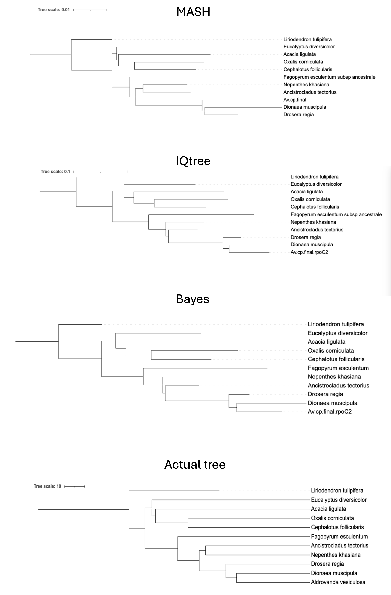

# Phylogeny Workshop

## Content
1. [Minhash and Neighbour-joining](#minhash-and-neighbour-joining)
2. [IQTREE2 - Maximum Likelihood](#iqtree2---maximum-likelihood)
3. [Bayesian inference (MrBayes)](#bayesian-inference-mrbayes)
4. [Comparison](#comparison)

## Introduction
In this session, we are going to construct phylogenetic trees in 3 different ways, so you can see the differences in speed and accuracy

### Minhash and Neighbour-joining
Minhash is used to quickly estimate Jaccard similarity between genomic datasets based on k-mers (substrings of fixed length). This distance relationship can be used to construct relational trees by methods such as NJ or ML. 

- to run this code in the julia REPL open the julia application:
```bash 
julia
```
- load Mashtree and contruct the Newick string. [recap what that was](https://en.wikipedia.org/wiki/Newick_format)

```bash
using Mashtree
# kmer size = 16, minhash sketch size = 100000
mashtree("/mnt/s-ws/everyone/annotation/", 16, 100000)
```
*[info on the influence of kmer size and msketch size](extras/kmer_sketch.md)*
- How long did it take to make this? Remember how long it felt and now **- Quit Julia with Ctrl-D**

- The tree has sequence IDs. But you can rename the sequence IDs to with the NCBI taxid:
    
    1. replace `xxx` with your Newick string [here if you are stuck](extras/newick1.md#mashtree)

    2. select the accession from the metadata file
    3. replace them

```bash
sourcedir=/mnt/s-ws/everyone/annotation/

tree="xxx"

while IFS=$'\t' read -r latin name taxid accession carnivorous australian
do
    tree=$(sed "s/$accession/$taxid/g" <<< $tree)
done < <(tail -n +2 $sourcedir/genome_metadata.tsv)
echo $tree
```
*[find full annotation of this here](extras/newick1.md)*

#### iTOL browser 
- paste the Newick tree into the [iTOL](https://itol.embl.de/) browser tool and click upload. This will show you the tree with the taxaid numbers. [here if you are stuck](extras/newick1.md#mash-newick-with-taxaid)

- **to display the species go to the control panel>Advanced and then scroll down to find the 'Other functions' section. Choose 'Autoassign taxonomy' 'NCBI'.** When the scary red panel pops up click 'assign taxonomy' and then 'reload page'.  

- Root the tree with *Liriodendron tulipifera* by clicking on the name. Go to the 'tree structure' in the drop down menu and choose 'reroot tree ...'
- What species is Aldrovanda most closely related to in this tree?
- Try different values for the kmer size (10–32) and the sketch size (1000–100000)
- Do you get different trees?


### IQTREE2 - Maximum Likelihood
IQTREE2 is a versatile software tool used for constructing phylogenetic trees based on maximum likelihood (ML) methods. It employs codon models for nucleotide sequence evolution, making it suitable for analyzing protein-coding genes

- First we will make a codon alignment using the multiple sequence alignment of proteins you made in the 'Genome Annotation' module to guide the alignment of the corresponding nucleotide sequences

```bash
cat *.rpoC2.nt.fa > allrpoC2.nt.fa
#the below calls to run the julia script
julia /mnt/s-ws/everyone/tools/nt2codon.jl rpoC2.protein.msa allrpoC2.nt.fa rpoC2.codon.msa
less rpoC2.codon.msa
```

- Now we can use iqtree2 to construct a phylogenetic tree by maximum likelihood using this data.
- `-T 16` tells iqtree2 to use 16 parallel 'threads' so that it can use multiple processors in the server simultaneously.
- `-st` CODON tells iqtree2 to use codon models for sequence evolution.
- `-o` is telling iqtree2 what the outgroup taxon is so it can root the trees correctly.
- `--alrt 1000` and `-B 1000` tell iqtree2 to estimate the confidence in the branches in the tree using 1000 replicates using an approximate likelihood ratio test (`--alrt`) and a conventional bootstrap test (`-B`). Much more info on [IQ-TREE here](http://www.iqtree.org/doc/)

- We're going to run iqtree in a batch queue to make sure the server can handle the load

```bash
batch

iqtree2 -T 16 -s rpoC2.codon.msa -st CODON -o NC_008326.rpoC2 --alrt 1000 -B 1000
```

- Ctrl-D to get out of batch

*Here a recap on checking cluster and server processes:*
- To see where you are in the queue:

```bash
atq
```

- you can use top to see what the server is doing

```bash
top
```

- type `q` to get out of top

- when `atq` no longer shows you in the queue, iqtree has finished

- the output log - How long did iqtree take (CPU time is what matters)?

```bash
less rpoC2.codon.msa.log
```

----
**Let's have a look at the tree**

```bash
less rpoC2.codon.msa.iqtree
```

You can find the Newick tree in the output. You can replace IDs as previously and look at it in iTOL. *[cheat link](extras/newick1.md)*

- paste the Newick tree into https://itol.embl.de/
- Is the tree the same or different to the one generated by Mashtree?


### Bayesian inference (MrBayes)

- Use the same data as for iqtree2, but it needs to be converted to [nexus](extras/nexus) format

```bash
julia /mnt/s-ws/everyone/tools/fasta2nex.jl rpoC2.codon.msa rpoC2.codon.nex

less rpoC2.codon.nex
```

1. Run MrBayes interactively by typing `mb`
2. set the codon model

```bash
exe rpoC2.codon.nex
```
3. the `lset` command sets the constraints on the sequence evolution model. Here we are using very permissive settings, so MrBayes will test many different possible parameters

```bash
lset nucmodel=codon omegavar=M3 nst=mixed rates=invgamma
```
4. The following commands set the frequency with which MrBayes provides feedback on progress; as this run is just to get an idea of how the Bayesian approach works, we are asking for more frequent updates than would be typical

```bash
mcmcp ngen=10000

mcmcp diagnfreq=1000

mcmcp samplefreq=100

mcmcp printfreq=100
```

5. Now we can start the run

```bash
mcmc
```

**Warning:** ⏳ **Prepare for a wait that rivals a Netflix binge!** ⏳

While MrBayes performs its Bayesian wizardry, you might have time to:
- Perfect your soufflé recipe 🍰
- Rewatch all seasons of your favorite show 📺
- Master the art of origami 🦢

---
*Tick tock, tick tock...*
---

Along the line you see the split frequencies pop up: 
*Split frequencies are a measure used in Bayesian phylogenetic analysis to assess the convergence of the Markov Chain Monte Carlo (MCMC) runs. They reflect the consistency between different runs of the analysis and help determine if the chains have converged to the same solution.*

*Significance*

*Convergence:* Split frequencies are used to assess if multiple MCMC chains are converging to the same posterior distribution. A lower average standard deviation indicates that the chains are more consistent with each other.

*Thresholds:* Typically, a value below 0.01 is considered good convergence. Your final value of e.g 0.009821 is below this threshold, indicating satisfactory convergence.

- so if your split frequencies look good say `no` to additional itrerations.


**Once the run has finished, we can inspect the output**

The `sump` command in Bayesian phylogenetic software (like MrBayes) is used to *summarize the results of a Bayesian analysis*. It provides a detailed summary of the sampled trees, including:

- *Tree Statistics*: Average tree lengths, node probabilities, and other metrics.
- *Convergence*: Information on the convergence of the chains.
- *Posterior Probabilities*: Frequencies of observed splits or clades across sampled trees.

In essence, `sump` helps you interpret the results of your MCMC run by summarizing the sampled trees and assessing the stability and convergence of your analysis.

```bash
sump
```

The `sumt` command in Bayesian phylogenetic software (like MrBayes) is used to *summarize and visualize the final set of trees* from a Bayesian analysis. It provides:

- *Consensus Tree*: A majority-rule consensus tree that represents the most frequent clades across all sampled trees.
- *Tree Statistics*: Information on the frequencies of different clades and their posterior probabilities.
- *Support Values*: Statistical support values for each clade based on the sampled trees.

In essence, `sumt` helps you interpret and visualize the most likely phylogenetic tree(s) and their support based on the MCMC samples.

```bash
sumt
```
- exit from `mb`
```bash
quit;
```


- look at the tree
```bash
cat rpoC2.codon.nex.con.tre 
```

Then paste the Nexus tree into https://itol.embl.de/ (you have to download the file to your computer or you can paste it but then you have to re-annonate it.)
*[cheat link](extras/newick1.md)*

---
### Comparison
The main aim today is to understand that there are different methods and how they work and what they produce.

- Let's take a look at the correct tree that is saved in the folder for you ([source](https://github.com/DrChooper/teaching/blob/main/Phylogeny.md))

- Use `less` to see the tree in Newick format

```bash
less /mnt/s-ws/everyone/annotation_phylogenetics/carnivores/carnivores.nw 
```
- paste the tree into https://itol.embl.de/ to visualise it in a graphical form

*[cheat link](extras/newick1.md)*

- Root the tree with *Liriodendron*
- What species is *Aldrovanda* most closely related to?

Now cmpare all 3 trees and all three computing times.

- Which of the three methods is the fastest? 
- Which is the most accurate?

Here the snapshots from my trees:



🌱🔍📊**Congratulations on completing the Phylogenetics lab!** 🌿🔬✨**or at the least you clicked all the cheat buttons and got to the end of this session. Hurray** 🎓

