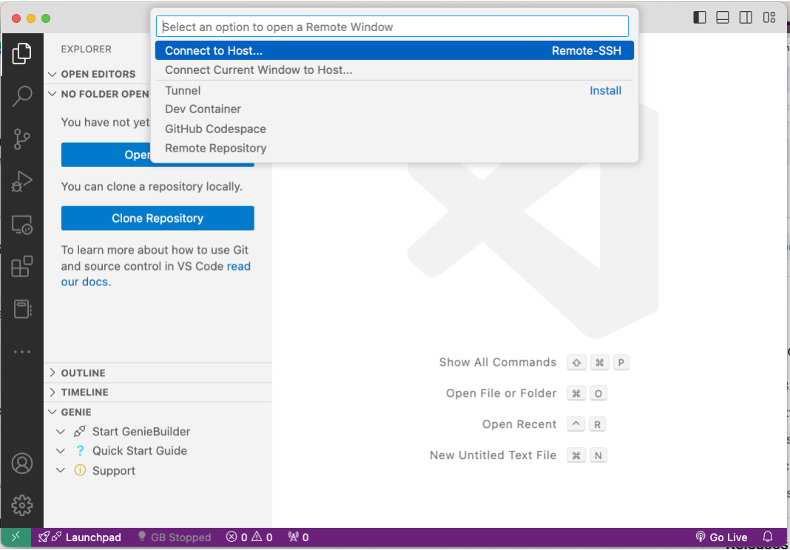
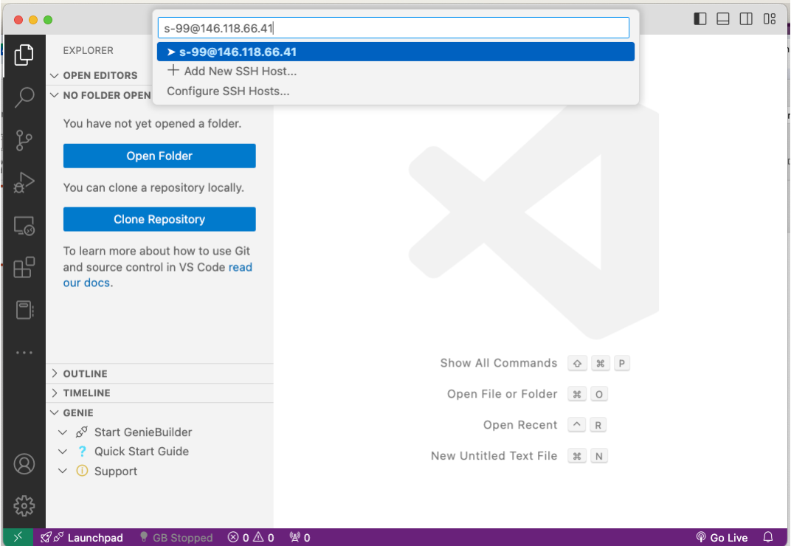
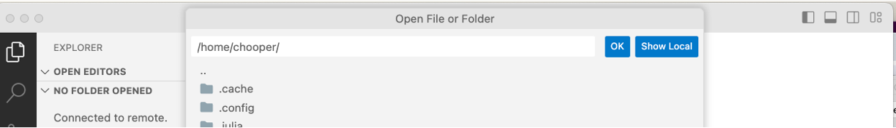
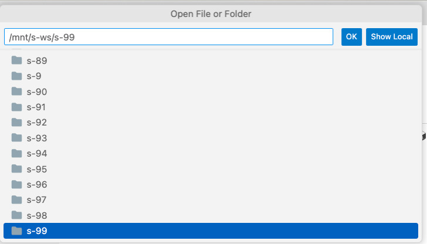

Here is the revised version with corrected spelling and improved clarity:

# Folders in the Prac

There has been a bit of confusion about where things are located, so I thought I'd provide some information here for you.

## Explanation

There are two different areas on the servers where I noticed students working, which caused issues with the commands I posted finding files. If you cannot find a file you need to:

1. Check where you copied your files.
2. Check where your command is looking.

If you arranged your files differently from the prac instructions (e.g., you added an additional directory to organize them), then you need to adjust some of the commands. *ChatGPT is fab at picking these things up.*

You need to distinguish between files that we provide (don't change those paths) and files that you have uploaded or created (these are the ones that the command might complain about not finding).

The last thing is that we sometimes set a directory variable `sourcedir`. These get lost when you log out and log back in or if you open a new terminal. So be sure to rerun this: `sourcedir = /path/to/whatever/you/need`

## Areas on the Server

### The Log-in Area - Home

When you log onto the server with SSH, you typically see the home directory, which is your home directory. Think of it as your landing folder that can quickly become cluttered as everything defaults to saving there.

The path looks like this if you have account s-99: `/home/s-99/`

And when you use the `cd ~` command, it will take you there "home" from anywhere on the server.

**Don't put your files here, but check if a file went here if it was copied and you cannot see it in your account!**

### The Account Folder

You may have noticed that your files and other things were always copied and created into your *account* folder. This is where you should put all the files that you have accumulated. So copy your files here (e.g., `Av.chloe.gff`, etc.).

This folder should also contain the `chloe` folder where the Julia command processes those GFF3 files.

It looks like this if you have account s-99: `/mnt/s-ws/s-99`

(`mnt` stands for mount, so this is a data volume that is better to "pollute" with files.)

### Shared Area

This is also on the mount, and this is where our source directory points to or where we have some files that you need to copy across or access.

An example is `/mnt/s-ws/everyone`.

## File Transfer and File Finding

I think the easiest way is to use VS Code to transfer files. You can do all tasks in VS Code:

### Connect to Server

In VS Code, find the green arrows button on the bottom left and choose `connect to host` (in the current window if you don't want to open a new one):

Then enter your account and your server. You will get prompted for your password.

### Open Your Directory to Avoid Getting Lost in Home

To get to your directory, click on the blue button on the left `open folder`. It will open the dialog and you will see the default is e.g., `/home/s-99` or whatever your account is.

This is where you can set your folder to the account area by providing the correct path. Then click OK.

You can now see the folder contents on the left and can navigate around in them. Here you also can right-click on a file and download it without using the command. To view another area, you need to open a new folder view.

### Filezilla

If you are copying files, no matter what you use, you need to make sure your transfer app is pointing at the right location. In Filezilla or similar apps, you need to check where it is putting your files. Check the path given at the top, and if it says `/home/s-99`, you will transfer it to home, not the account folder. So change it to the account folder to transfer your files straight there. If you copied them into the home area you can use `mv` to move them onto the right area.

**Make sure your files are all in the account area**.